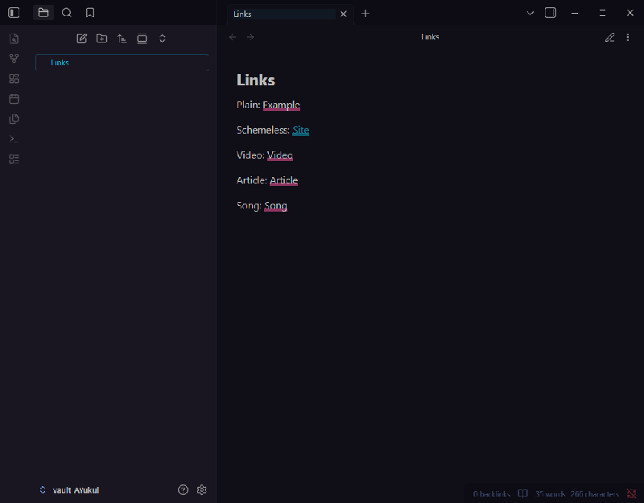
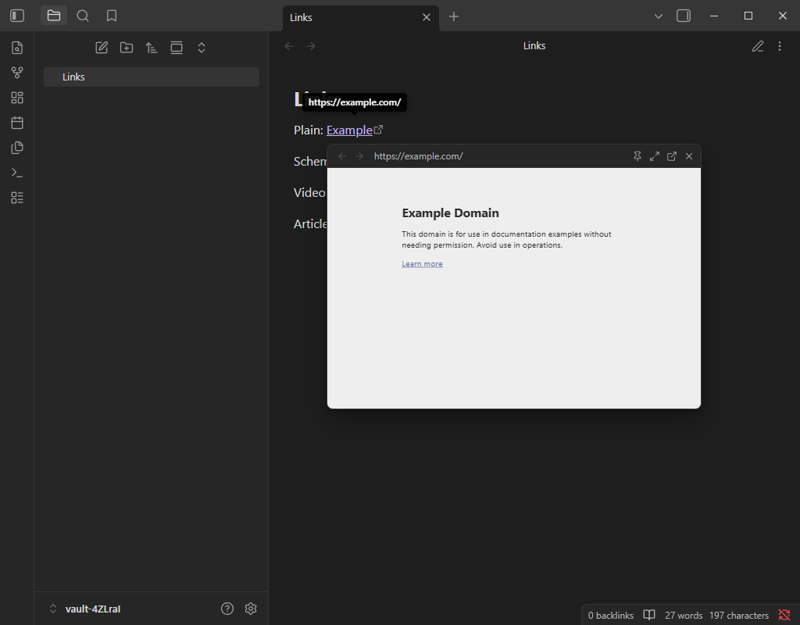
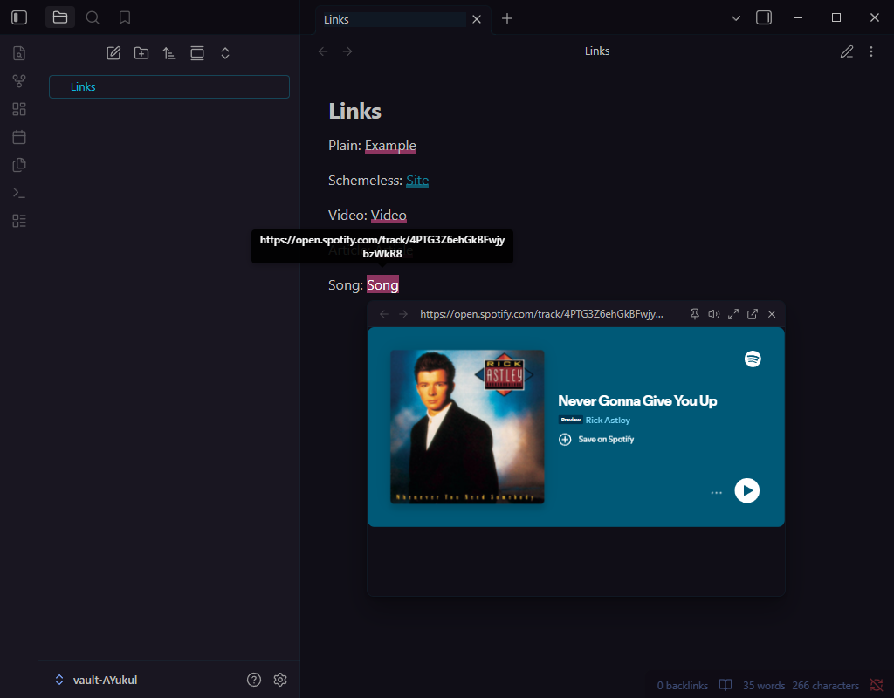
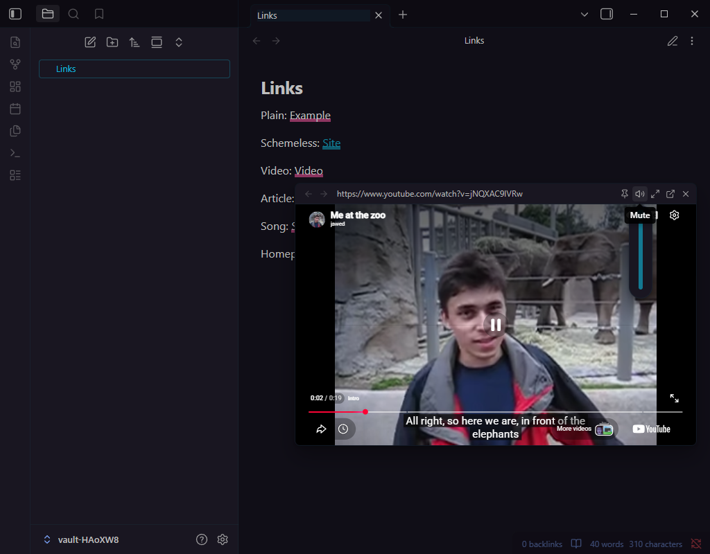
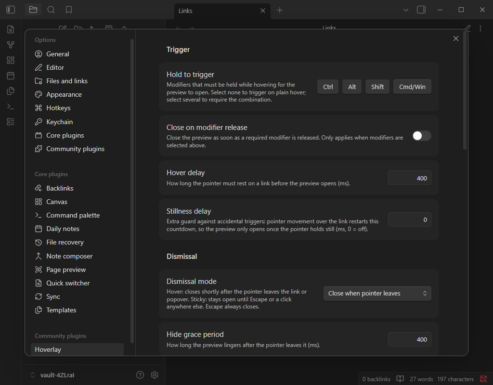

# Hoverlay

[](https://github.com/zspatter/obsidian-hoverlay/actions/workflows/ci.yml)
[](https://github.com/zspatter/obsidian-hoverlay/actions/workflows/e2e.yml)

Link previews on hover for [Obsidian](https://obsidian.md) that work on real websites.

Hover any external link, in a note, a Canvas card, or a pop-out window, and a floating preview opens: the live page, a clean reader view, or a metadata card, with embedded players for media links. Browse inside it, pin it, resize it, or send it to your browser.



## Why another link preview plugin

Existing hover-preview plugins render pages in an `<iframe>`. Any site that sends `X-Frame-Options` or a CSP `frame-ancestors` header (GitHub, Reddit, Wikipedia, most of the web you actually link to) silently refuses to render there, leaving a blank pane. Hoverlay sidesteps that class of failure entirely:



- **Live page (desktop):** previews render in an Electron `<webview>`, a separate guest page doing top-level navigation. Framing headers don't apply to it, so real sites load.
- **Reader view:** fetches the page, extracts the article with Mozilla Readability, sanitizes it, and renders just the text in your theme's typography. No scripts or trackers ever run.
- **Metadata card:** OpenGraph/Twitter card with title, description, image and favicon, fetched through Obsidian's own request pipeline (immune to CORS, no third-party preview APIs, no keys). The automatic fallback whenever a richer mode can't render, and the default on mobile.
- **Embedded players:** media links (YouTube, Vimeo, Dailymotion, Streamable, Loom, Spotify, SoundCloud, Deezer, Apple Music, Apple Podcasts) load the provider's embed player instead of the full page: lighter, no cookie walls, playlists and timestamps preserved. The popover trims itself to the player's natural size, so there's no dead space below a Spotify card or letterboxing around a video.



## Using the popover



- **Hover** an external link (optionally behind a modifier combination), wait the configured delay, get a preview. Works in reading view, live preview and source mode; editor links are resolved from the document itself, so live preview's folded `[text](url)` links work.
- **Canvas:** links inside Canvas text cards preview too. Canvas covers cards with an event shield, so Hoverlay hit-tests the link under your pointer through it; no need to enter the card first.
- **Pop-out windows:** hovers in a pop-out open the preview in that window, sized to that window, with all the same controls.
- **Header controls:** back/forward history, the current URL, maximize/restore, pin (stay open until Escape or a click elsewhere), mute with a volume slider on hover, open in browser, close.
- **Move and size it:** drag the header to reposition; drag any edge or corner to resize (optionally remembered as the new default).
- **Zoom:** hold the zoom key and scroll over the preview; a percentage badge appears, and clicking it resets to 100%.
- **Mouse back/forward buttons** navigate the preview's history when over it, and keep navigating your notes when not.
- **Keyboard:** bind the "Preview link under cursor" command to a hotkey to open previews without the mouse. Escape always closes.
- **Audio:** embedded players start audible; ordinary pages stay muted (no autoplay noise) until you unmute via the speaker button, which appears whenever a page plays media.

## Settings



- **Trigger:** modifier combination (any of Ctrl/Alt/Shift/Cmd, or none for plain hover), close on modifier release, hover delay, and an optional stillness delay so sweeping the pointer across text never triggers.
- **Dismissal:** hover mode (closes when the pointer leaves, with a grace period) or sticky mode (Escape or click elsewhere).
- **Preview:** mode (auto, live page, reader, card), popover size, remember-resized-size, page zoom, zoom key (Ctrl/Alt/Shift or Off), embedded players toggle, media volume.
- **Filtering:** per-domain preview modes (`host: mode`, subdomains inherit, most specific wins, `embed` and `webview` available as forcing overrides) and a domain blocklist.

## Behavior notes

- Internal links are never touched; core Page Preview owns those. Scheme-less targets (`[site](www.example.com)`) are normalized to https, gated behind a known-TLD list, and resolved against your vault first so notes are never mistaken for web domains.
- Privacy: live page previews load the real page (scripts and all) inside the sandboxed webview. Reader and card modes only ever fetch the page HTML. If you prefer fetch-only behavior for certain sites or globally, per-domain modes and the global mode setting cover both.
- Mobile: webviews don't exist there, so previews use the metadata card (or reader mode).
- Canvas: with hover dismissal, the preview stays open while the pointer is anywhere on the card (the card's event shield means Hoverlay can't see the exact moment you leave the link text); leaving the card or pressing Escape closes as usual.
- Some videos restrict embedded playback (typically major-label music); the player shows "Video unavailable" with a Watch on YouTube link in that case. `host: webview` in per-domain modes forces the full page for a site if you prefer.

## Installation

Until Hoverlay is in the community catalog, install manually: download `main.js`, `manifest.json` and `styles.css` from the [latest release](https://github.com/zspatter/obsidian-hoverlay/releases) into `<vault>/.obsidian/plugins/hoverlay/`, then enable it in Community plugins. [BRAT](https://github.com/TfTHacker/obsidian42-brat) also works with this repo.

## Development

```bash
npm install
npm run dev        # watch build
npm run build      # typecheck + production build
npm test           # unit + component tiers (vitest)
npm run test:e2e   # end-to-end against real Obsidian (wdio-obsidian-service)
```

To test in a vault, copy or symlink `manifest.json`, `main.js`, and `styles.css` into `<vault>/.obsidian/plugins/hoverlay/`.

### Testing

`npm test` runs two tiers: pure-module unit tests, including exhaustive permutation sweeps for modifier combinations, zoom-key conflict resolution, renderer selection and popover geometry, and jsdom tests covering the popover's interaction behavior (dismissal permutation matrix included), metadata parsing and the reader's sanitization pipeline. New decision logic should arrive as a pure function with a permutation sweep.

`npm run test:e2e` runs the third tier: end-to-end specs under `e2e/` driving real Obsidian via wdio-obsidian-service (hover previews across every preview mode, dismissal, embeds, scheme-less normalization, the cursor command, Canvas cards, and pop-out windows). Set `OBSIDIAN_VERSIONS="latest/latest"` to narrow the version matrix locally.

CI gates every push and pull request with the unit/component tiers (`ci.yml`) and runs the e2e matrix (`e2e.yml`) on PRs and main, across obsidian-version (earliest supported and latest, catching installer-pinned Chromium differences) and OS (Windows, macOS, Linux). Both reschedule weekly to catch upstream drift.

## Roadmap

- [ ] Additional embed providers on request (the transform table makes new ones cheap)

Explored and dropped: wrapping embeds in a framed host page. Tested in a real webview; label-restricted YouTube videos show "Video unavailable" framed or not, so the idea buys nothing (it would unlock Twitch, but at the cost of a second embed pathway with degraded audio controls).

## License

[MIT](LICENSE)
